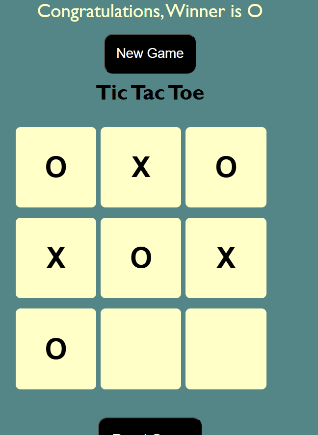

# PRODIGY_WD_03

This project is a simple **Tic Tac Toe** game built using **HTML**, **CSS**, and **JavaScript**.

## Features

- Interactive 3x3 Tic Tac Toe board
- Two-player mode
- Win and draw detection
- Responsive design

## Getting Started

1. Clone the repository.
2. Open `index.html` in your browser.

## Technologies Used

- HTML
- CSS
- JavaScript

## Screenshots

## License

This project is for educational purposes.